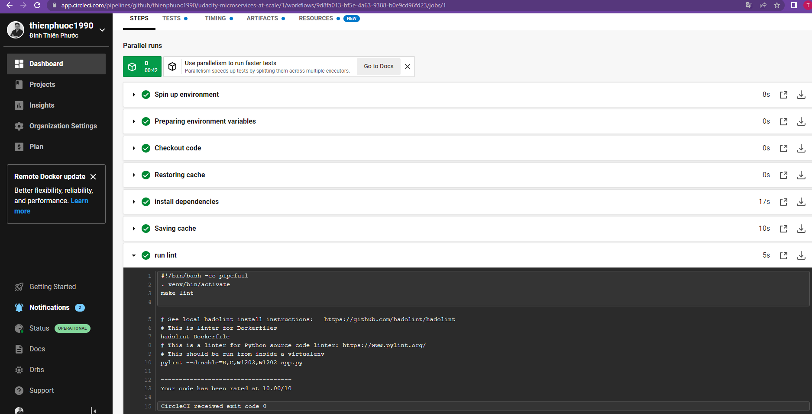

## Prerequisites
These software must be installed in your machine
1. Docker
1. K8s

## Run docker on local
1. Change dockerpath in file ./run_docker.sh base on your credentials
1. Run run_docker.sh to build and run docker file
> ./run_docker.sh

## Push docker image to dockerhub
1. Change dockerpath in file ./upload_docker.sh
1. Export your docker hub password to system environment
> export DOCKER_PASSWORD=<YOUR_PASSWORD>
1. run upload_docker.sh to upload to dockerhub with your tag
> ./upload_docker.sh

## Run with k8s
1. Change dockerpath in file run_kubernetes.sh
1. Run run_kubernetes.sh
> ./run_kubernetes.sh

## Link Docker Hub
https://hub.docker.com/r/thienphuoc1990/udacity-microservices-at-scale

## CircleCI screenshot

